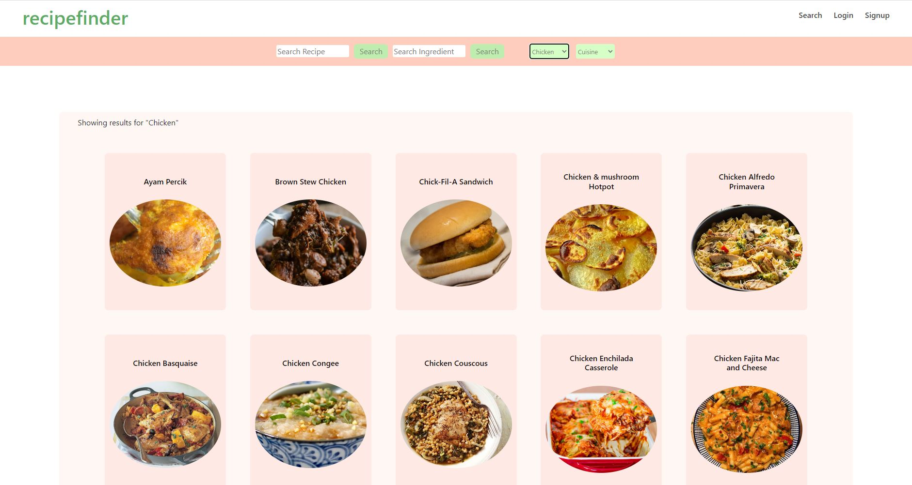

# Recipe Finder

[RecipeFinder](https://recept-main.herokuapp.com/)

## Overview

Recipe Finder - это веб-приложение на базе MERN (MongoDB, Express, React, Node.js), которое позволяет пользователям искать и сохранять рецепты. Приложение также позволяет добавлять ингредиенты рецептов в корзину и заказывать продукты или отправлять список покупок по электронной почте.

## Features

-Пользователь может искать рецепты по ключевым словам, ингредиентам или кухне.
-Пользователь может создать учетную запись и сохранять рецепты для дальнейшего использования.
-Пользователь может добавлять ингредиенты рецептов в корзину или список покупок.
-Пользователь может заказать продукты или отправить список покупок по электронной почте.
-Пользователь может просмотреть информацию о питании для рецепта.

## Installation

Чтобы запустить приложение локально, клонируйте репозиторий и перейдите в корневой каталог. Установите зависимости с помощью npm install.

Вам также потребуется создать файл .env в корневом каталоге и установить следующие переменные окружения:

## Technologies Used

-MongoDB  
-Express  
-React  
-Node.js  
-JWT  
-Bootstrap / React Bootstap / Icons  
-Stripe  
-Custom CSS  
-GraphQL  
-env-cmd (Protect sensitive key information on the client side)  
-API call from TheMealDB  

## Screenshots

## Contributors

[Michelle Tran](https://github.com/michelletrn) 
[Peter Lim](https://github.com/peterlim995) 
[Justin Yi](https://github.com/inputName-jy) 
[Thomas Maly](https://github.com/ThomasJay44)
 
## Acknowledgements

-Этот проект был вдохновлен всеми теми сайтами с рецептами, где вместо того, чтобы перейти непосредственно к нужной информации, на страницу вставляется полная история жизни автора. лол кек xD
